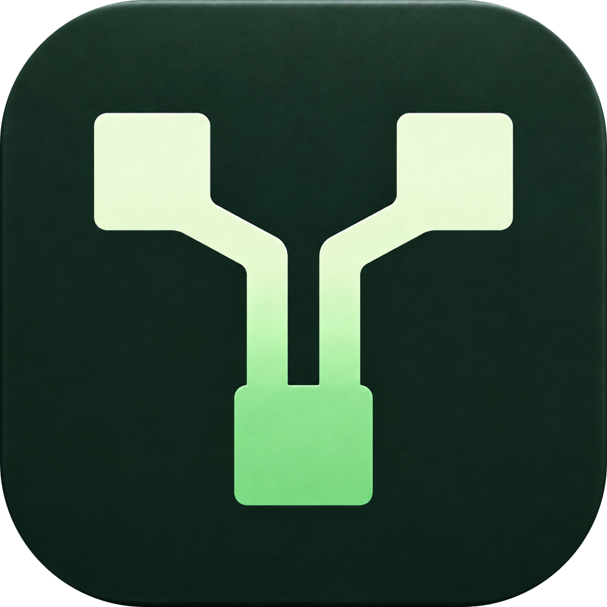

<p align="center">
  
</p>

# Mindarchy

[](https://github.com/tcballard/omarchy-badges)

**Mind mapping, at home on Omarchy.**

Mindarchy is an open-source desktop application for turning ideas into connected thoughts, practical plans, and next actions. Capture a rough outline, arrange it visually, and keep the result in local files you control.

Built with Qt Quick and C++20, Mindarchy puts Omarchy first while developing a thoughtful experience on macOS and Windows. The goal is to make choosing Linux easier by bringing care, polish, and portable workflows to everyday applications.

Mindarchy is under active development. Platform builds and individual features continue to receive testing and refinement.

## What you can do

- **Think at keyboard speed.** Create children and siblings, edit rich text, navigate branches, and reorganize ideas with undo and redo.
- **Arrange your thoughts.** Choose horizontal, vertical, or compact layouts. Use automatic placement or position branches manually. In manual mode, folding and expanding keep parents and surrounding branches anchored.
- **Turn plans into action.** Add tasks with branch progress, notes, and calendar nodes. Start with weekly task lists or meeting templates containing notes, decisions, and actions.
- **Connect the context.** Link related branches, embed images, and attach references to websites and local files.
- **Find your thread.** Search titles, notes, and calendar entries. Focus on a branch while keeping its place in the larger map.
- **Make the map yours.** Apply themes with bundled fonts, customize node shapes and colors, and adjust text and connector styles.
- **Keep your work together.** Open documents in tabs or separate windows, copy entire branches between maps, and paste indented text or Markdown lists as a hierarchy.
- **Keep your files.** Save readable `.omm` documents, reopen them across platforms, and export PNG images.

## Platforms

| Platform | Desktop experience |
| --- | --- |
| **Omarchy / Linux** | Wayland support, a shell that follows Omarchy theme changes, desktop file associations, and a native Arch package workflow. |
| **macOS** | Native application menus and window controls, system file dialogs, Finder integration, Quick Look previews, and installer tooling. |
| **Windows** | Native file dialogs, integrated window controls, Explorer file associations, and a per-user installer targeting Windows 11 x64. |

On Omarchy, new documents default to the Omarchy theme. Other platforms default to Porcelain. Existing documents retain their chosen theme; system theme changes affect the application shell independently of the map.

Windows ARM64 currently uses the x64 build through emulation. Native ARM64 Windows builds are not available. Linux desktop integration outside Omarchy depends on the compositor and file manager.

## Get started

Build the application using the instructions below, then create a blank map or open the included [welcome map](examples/Welcome.omm). The [sample collection](examples/refined-themes) includes maps in several themes.

1. Name the central idea.
2. Press **Tab** to add a child or **Enter** to add a sibling.
3. Add notes, tasks, dates, images, or links using the inspector.
4. Arrange the branches, connect related ideas, and fold details when you want an overview.
5. Save your map as an `.omm` document.

Select **Help → Keyboard Shortcuts** for the full reference. On Omarchy, the application menu is in the header. On Windows, press **Alt** to reveal the menu bar.

| Action | Linux / Windows | macOS |
| --- | --- | --- |
| Add child / sibling | Tab / Enter | Tab / Return |
| Edit selected title | Ctrl+Enter or F2 | Cmd+Return or F2 |
| Fold / expand branch | Alt+F | Option+F |
| Find in map | Ctrl+F | Cmd+F |
| Focus selected branch | Ctrl+Shift+F | Cmd+Shift+F |
| Connect two selected nodes | Ctrl+L | Cmd+L |
| Copy / paste branches | Ctrl+C / Ctrl+V | Cmd+C / Cmd+V |
| Save document | Ctrl+S | Cmd+S |
| New tab | Ctrl+T | Cmd+T |
| New window | Ctrl+N | Cmd+N |
| Close active tab | Ctrl+W | Cmd+W |
| Next / previous tab | Ctrl+Tab / Ctrl+Shift+Tab | Control+Tab / Control+Shift+Tab |
| Undo | Ctrl+Z | Cmd+Z |

The tab bar appears when a window contains two or more mindmaps and hides again when only one remains. Tabs sit below the toolbar, between any open sidebars, with the same styling and behavior on every platform. Drag tabs to reorder them, or use a tab’s context menu to move it into a separate window. Tab commands also work from text fields; an invalid title edit must be corrected before switching, and modal dialogs temporarily block tab commands.

Canvas shortcuts apply when a text field is not being edited. Typing with a text or task node selected replaces its title; use the edit shortcut to modify the existing text. Hold **Space** and drag to pan. Trackpad scrolling pans the canvas.

## Your documents

Mindarchy works locally without an account. An `.omm` file is a versioned UTF-8 JSON document containing the map's structure, content, embedded images, and styling. The same document format is used on all desktop platforms.

Use **Save** to write changes to the document. Session recovery stores separate local snapshots; it does not replace explicitly saving or backing up your files.

Images added to nodes are embedded in the document. Files added through **Links & Resources** remain external references. Move those files with the map to keep links usable on another computer. Web links open in your default browser only when you choose to open them.

**Export PNG** captures the current canvas viewport. Fit the map into view before exporting a full visible overview. You can also render a saved document from the command line:

```sh
mindarchy --render-preview Project.omm --preview-output Project.png
```

This command assumes the executable is on your PATH. For an uninstalled build, use its executable path instead.

Mindarchy documents are its own format. Direct import of other applications' proprietary mind-map files is not currently supported. Indented text and Markdown lists can be pasted into a map. Cloud synchronization and real-time collaboration are not included.

## Build from source

Run the following commands from the repository root. CMake is the common build entry point.

Quick variant for building specific OS:

```bash
VERSION=0.1.0 ./scripts/build_macos.sh
VERSION=0.1.0 ./scripts/build_omarchy.sh
WINDOWS_QT_DIR='C:\Qt\6.11.2\msvc2022_64' ./scripts/build_windows.sh
./scripts/build_all.sh
```

macOS uses the existing build/test/DMG+PKG workflow, unsigned by default. Set `MACOS_SIGN=1` for signing with the existing release credentials; extra arguments such as `--qt` and `--arch` pass to the release tool. Output: `dist/macos/`

### Requirements

- CMake 3.21 or newer.
- A C++20 compiler: GCC, Clang, or MSVC.
- Qt 6.6 or newer with Core, Gui, Qml, Quick, QuickControls2, Test, and Network. Current development uses Qt 6.11.2.
- A build tool such as Make or Ninja.

macOS also requires Xcode command-line tools. Windows requires Visual Studio 2022 C++ Build Tools, the Windows SDK, and a matching MSVC x64 Qt kit.

### Omarchy / Arch Linux

Install the build dependencies:

```sh
sudo pacman -S --needed base-devel cmake qt6-base qt6-declarative qt6-wayland
```

Build and run:

```sh
cmake -S . -B build -DCMAKE_BUILD_TYPE=Release
cmake --build build --parallel
./build/mindarchy
```

For a package with desktop integration, run the packaging script on the target Omarchy or Arch machine:

```sh
bash scripts/build_omarchy.sh
```

The script writes an architecture-specific package to `artifacts/omarchy` and prints the installation command. Install the generated package with `sudo pacman -U` followed by its path. Build as a regular user.

### macOS

Install the required Qt modules, then set `QT_PREFIX_PATH` to your Qt kit directory. For example, a standard Qt 6.11.2 installation uses:

```sh
export QT_PREFIX_PATH="$HOME/Qt/6.11.2/macos"
cmake -S . -B build -DCMAKE_BUILD_TYPE=Release -DCMAKE_PREFIX_PATH="$QT_PREFIX_PATH"
cmake --build build --parallel
open build/mindarchy.app
```

The Qt kit must support your target architecture.

### Windows

Install CMake, Ninja, the compiler toolchain, and Qt. Open an **x64 Native Tools Command Prompt for VS 2022**, start PowerShell from that prompt, and set the Qt path to your installation:

```powershell
$env:QT_PREFIX_PATH = 'C:\Qt\6.11.2\msvc2022_64'
$env:PATH = "$env:QT_PREFIX_PATH\bin;$env:PATH"
cmake -S . -B build -G Ninja -DCMAKE_BUILD_TYPE=Release "-DCMAKE_PREFIX_PATH=$env:QT_PREFIX_PATH"
cmake --build build --parallel
& "$env:QT_PREFIX_PATH\bin\windeployqt.exe" --release --qmldir qml .\build\mindarchy.exe
.\build\mindarchy.exe
```

### Tests

After building, run the configured test suites:

```sh
ctest --test-dir build --output-on-failure
```

The suites cover document operations, layout, manual placement, canvas input, QML interactions, previews, and platform-specific window behavior. Some platform tests require a graphical desktop session.

## Build installers

The repository includes packaging tools for each desktop platform. These build artifacts locally; they do not publish a release.

| Platform | Tool | Output |
| --- | --- | --- |
| Omarchy / Arch | [build_omarchy.sh](scripts/build_omarchy.sh) | Native package in `artifacts/omarchy`. |
| macOS | [release-macos.py](scripts/release-macos.py) | Application and installer artifacts with checksums and release metadata under `dist/macos`. |
| Windows | [release-windows.ps1](scripts/release-windows.ps1) | Per-user EXE installer and checksum under `artifacts/windows`. Requires Inno Setup. |

The macOS tool supports Developer ID signing and notarization. Windows signing requires publisher configuration. Unsigned development artifacts should be identified as such when distributed.

## Contribute

Bug reports, documentation improvements, platform testing, sample maps, and code contributions are welcome.

For a bug report, include the application version or commit, operating system, steps to reproduce, and the expected and actual behavior. A small example map or screenshot helps; remove private content and local file references before sharing it.

For a substantial feature or change in interaction, open an issue first to discuss the intended workflow. Keep pull requests focused, add regression coverage for behavior changes, and run the relevant test suites. Describe which platforms you tested.

The main source areas are:

| Directory | Responsibility |
| --- | --- |
| `src/` | Document engine, layout, rendering, input, persistence, and platform integration. |
| `qml/` | Application interface, inspector, menus, and dialogs. |
| `tests/` | Engine, canvas, interface, and platform tests. |
| `examples/` | Sample documents. |
| `scripts/` and `packaging/` | Build, installation, and release tooling. |

## License

Original Mindarchy code, documentation, and original assets are licensed under the **Apache License 2.0**. See [LICENSE.md](LICENSE.md) for the full terms and component-specific notices.

Qt, bundled fonts, icons, and other third-party components retain their respective licenses. Font notices are included in [assets/fonts](assets/fonts), and icon notices are in [qml/icons](qml/icons). Documents you create remain yours; using Mindarchy does not apply the application's license to your content.
